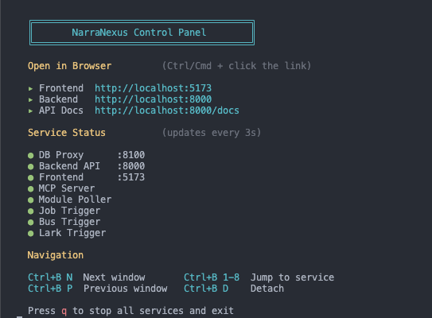

<div align="center">


<br/>
<br/>

**A framework for building nexuses of agents -- where intelligence emerges from interaction, not isolation.**

[](https://creativecommons.org/licenses/by-nc/4.0/)
[](https://www.narranexus-agent.ai/docs/getting-started/quick-start)
[](https://www.python.org/)
[](https://react.dev/)
[](https://fastapi.tiangolo.com/)
[](https://modelcontextprotocol.io/)

**English** | [中文](./README_zh.md)
</div>

<br/>

Most agent frameworks focus on making agents *smarter*. NarraNexus focuses on making agents *connected*.

An agent in isolation is a tool. An agent with memory, identity, relationships, and goals becomes a participant in a **nexus** -- a network where intelligence is a collective property, not just a model property.

NarraNexus provides the infrastructure for this: persistent memory, relationship-aware context, task scheduling, modular capabilities, and agent-to-agent communication.

## What Makes NarraNexus Different

### Persistent Context

NarraNexus agents carry context across conversations through long-term memory, event memory, and relationship-aware retrieval. This allows agents to continue from past interactions instead of starting over every time.

### Composable Runtime

Core capabilities such as Memory, Awareness, Chat, RAG, Jobs, Skills, Social Network, and Matrix run as independent modules. Each module manages its own tools, data, and lifecycle, making the system easy to extend or customize.

### Connected Agents

Agents can communicate through Matrix-based messaging and use MCP tools to coordinate with other agents, external tools, and background workflows.

## Quick Start
### Online Version (Coming soon)

Try NarraNexus instantly in the browser:

> [Launch NarraNexus](https://www.narranexus-agent.ai/)

### Download the App (MacOS only)

Download the latest desktop app from GitHub Releases, then choose the file ending with `.dmg`.

> [Download Latest Release](https://github.com/protagolabs/NarraNexus/releases)

### Install from Source

#### Prerequisites

| Dependency | Why | Install |
|------------|-----|---------|
| **Node.js** (v20+) | Frontend build | Install via [nvm](https://github.com/nvm-sh/nvm) (recommended): `curl -o- https://raw.githubusercontent.com/nvm-sh/nvm/v0.40.1/install.sh \| bash && nvm install 20` |
| **uv** | Python environment & dependency management | `curl -LsSf https://astral.sh/uv/install.sh \| sh` |

If either is not detected, `run.sh` will print the install command and exit. Install it, then re-run.

```bash
git clone https://github.com/NetMindAI-Open/NarraNexus.git
cd NarraNexus
bash run.sh
```

The script auto-detects your OS (Linux / macOS / Windows WSL2) and handles the rest of the dependencies.

After setup, you will see the image below. Then
1. Open `http://localhost:5173` in your browser

    a. Choose **Local** or **Cloud (Coming soon)** mode to register an account.

    b. Follow the on-screen instructions to set up the API key. For details, see [LLM Provider Configuration](#llm-provider-configuration).

    c. Start chat!
2. Open `http://localhost:8000/docs` for API Docs.
<br/>

<p align="center">
  
</p>

<p align="center">
  <em>Setup complete — ready to open the interface</em>
</p>

For more details, see the [installation instructions](https://www.narranexus-agent.ai/docs/getting-started/quick-start) in the docs.

## LLM Provider Configuration

NarraNexus uses a **three-slot** architecture for LLM access:

| Slot | Protocol | Purpose |
|------|----------|---------|
| **Agent** | Anthropic | Core reasoning -- powers the agent's thinking, tool use, and multi-turn conversations |
| **Embedding** | OpenAI | Converts text to vectors for narrative matching and semantic search |
| **Helper LLM** | OpenAI | Lightweight tasks -- entity extraction, summarization, module decisions |

### Setup Options

| Option | What you need | Result |
|--------|--------------|--------|
| **[NetMind.AI Power](https://www.netmind.ai/)** | One API key | Covers all 3 slots. Quickest setup. |
| **Claude Code Login + OpenAI** | Claude Code CLI login + OpenAI API key | Agent via OAuth (free tier available), rest via OpenAI |
| **Anthropic + OpenAI** | Anthropic API key + OpenAI API key | Full control over both providers |
| **Custom endpoints** | Any Anthropic/OpenAI compatible URL | For proxies, self-hosted models, or alternatives |

> **Note**: Currently only **OpenAI official API** and **NetMind.AI Power** are supported for embedding. More providers coming soon.

Configure through the setup wizard (desktop app) or the LLM Providers panel (web UI, click the CPU icon in the header). Config is stored at `~/.nexusagent/llm_config.json`.

### Optional API Keys

#### Configure Long-term Memory (EverMemOS) (Coming soon)

EverMemOS gives the agent long-term episodic memory.

| What you configure | Result |
|--------------------|--------|
| **Nothing** | Agent works normally, memory features disabled |
| **LLM key only** | Memory extraction enabled, semantic search needs additional keys |
| **All keys** | Full long-term memory -- cloud-based, no GPU required **(recommended)** |

You can also edit `.evermemos/.env` manually at any time. See the [EverMemOS documentation](https://github.com/EverMind-AI/EverMemOS) for details.


## Key Features

| Feature | Description |
|---------|-------------|
| **Narrative Memory** | Conversations routed into semantic storylines, retrieved by topic similarity across sessions |
| **Hot-Swappable Modules** | Standalone capabilities (chat, social graph, RAG, jobs, skills) with their own DB, tools, and hooks |
| **Inter-Agent Communication** | Agents coordinate via Matrix protocol -- rooms, messages, @mentions, group chats |
| **Skill Marketplace** | Browse and install skills from ClawHub via natural language |
| **Social Network** | Entity graph tracking people, relationships, expertise, and interaction history |
| **Job Scheduling** | One-shot, cron, periodic, and continuous tasks with dependency DAGs |
| **RAG Knowledge Base** | Document indexing and semantic retrieval via Gemini File Search |
| **Long-term Memory** | Episodic memory powered by EverMemOS (MongoDB + Elasticsearch + Milvus) |
| **Cost Tracking** | Real-time metering of every LLM call with per-model cost breakdowns |
| **Execution Transparency** | Every pipeline step visible in real time -- what the agent decided, why, and what changed |
| **Multi-LLM Support** | Claude, OpenAI, and Gemini via unified adapter layer |
| **Desktop App** | Desktop application with auto-updater and one-click service orchestration |

<br/>


<p align="center"><em>NarraNexus in action</em></p>

<br/>

## UI Guide

## Data Directory (`~/.narranexus/`)

NarraNexus stores runtime logs in a user-level directory at `~/.narranexus/`. This directory is created automatically on first run and does not contain any user data or secrets -- only service logs.

```
~/.narranexus/
└── logs/
    ├── backend/                 # FastAPI backend (HTTP + WebSocket)
    │   └── backend_YYYYMMDD.log
    ├── mcp/                     # MCP servers (one per Module)
    │   └── mcp_YYYYMMDD.log
    ├── module_poller/           # Instance completion poller
    │   └── module_poller_YYYYMMDD.log
    ├── job_trigger/             # Job scheduler
    │   └── job_trigger_YYYYMMDD.log
    ├── lark_trigger/            # Lark/Feishu IM bot subscriber
    │   └── lark_trigger_YYYYMMDD.log
    └── message_bus_trigger/     # Agent-to-agent inbox poller
        └── message_bus_trigger_YYYYMMDD.log
```

- **One file per process per day** — daily rotation at midnight, old logs compressed (`.zip`) and retained 30 days. Per-event trace is recovered by grepping across these files for `event_id=evt_…`, `run_id=run_…`, or `trigger_id=lark_…/job_…/ws_…/bus_…/a2a_…`
- **Configuration via env**: `NEXUS_LOG_LEVEL` (default `INFO`; raise to `DEBUG` or `TRACE` to inspect bodies / SQL), `NEXUS_LOG_FORMAT` (`text` default, `json` for jq-friendly cloud deploys), `NEXUS_LOG_DIR` (override the root path)
- **Operator HTTP API**: `/api/admin/logs/services` lists what's available, `/api/admin/logs/<service>/tail?n=&level=` tails, `/api/admin/logs/event/<event_id>` greps for one event's full trace
- **Frontend SystemPage** has a built-in viewer over the same endpoints, including a search box for trace identifiers
- **Safe to delete**: the entire `~/.narranexus/` directory can be safely removed at any time -- it will be recreated on next run
- **Desktop app**: uses the same `~/.narranexus/` path (on macOS: `~/.narranexus/`, not inside `~/Library/Application Support/`); the Tauri sidecar drains each subprocess's stdout/stderr into the same files, so behavior matches `bash run.sh`

## Documentation

| Document | Description |
|----------|-------------|
| [`.nac_doc/_overview.md`](./.nac_doc/_overview.md) | Documentation system entry point with project overview and reading path |
| `CLAUDE.md` | Ironclad rules, architecture, module creation steps, coding standards |
| [`.nac_doc/README.md`](./.nac_doc/README.md) | NAC Doc methodology (three-tier documentation system) |
| [`.nac_doc/project/`](./.nac_doc/project/) | Deep references and task playbooks (Tier-3) |

## Star History

<a href="https://star-history.com/#NetMindAI-Open/NarraNexus&Date">
 <picture>
   <source media="(prefers-color-scheme: dark)" srcset="https://api.star-history.com/svg?repos=NetMindAI-Open/NarraNexus&type=Date&theme=dark" />
   <source media="(prefers-color-scheme: light)" srcset="https://api.star-history.com/svg?repos=NetMindAI-Open/NarraNexus&type=Date" />
   
 </picture>
</a>

## Acknowledgments

NarraNexus's long-term memory system is built on [EverMemOS](https://github.com/EverMind-AI/EverMemOS), a self-organizing memory operating system for structured long-horizon reasoning. We thank the EverMemOS team for their foundational work.

> Chuanrui Hu, Xingze Gao, Zuyi Zhou, Dannong Xu, Yi Bai, Xintong Li, Hui Zhang, Tong Li, Chong Zhang, Lidong Bing, Yafeng Deng. *EverMemOS: A Self-Organizing Memory Operating System for Structured Long-Horizon Reasoning.* arXiv:2601.02163, 2026. [[Paper]](https://arxiv.org/abs/2601.02163)

## Citation

If you find NarraNexus useful, please cite it as:

```bibtex
@software{narranexus2026,
  title        = {NarraNexus: A Framework for Building Nexuses of Agents},
  author       = {NetMind.AI},
  year         = {2026},
  url          = {https://github.com/NetMindAI-Open/NarraNexus},
  license      = {CC-BY-NC-4.0}
}
```

## License

[CC BY-NC 4.0](./LICENSE)
