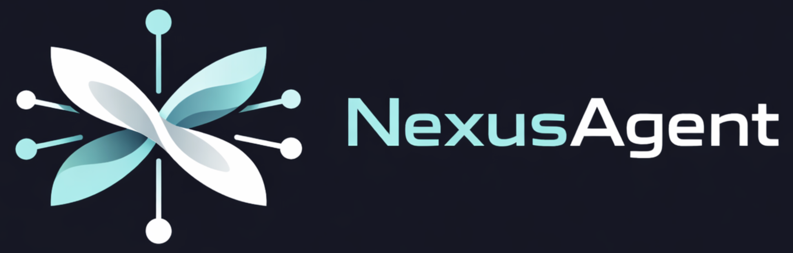

<div align="center">



<br/>
<br/>

**构建 Agent 之间的「连接网络」-- 让智能从交互中涌现，而非孤立运行。**

[](./LICENSE)
[](https://www.python.org/)
[](https://react.dev/)
[](https://fastapi.tiangolo.com/)
[](https://modelcontextprotocol.io/)

[English](./README.md) | **中文**

</div>

<br/>

大多数 Agent 框架的目标是让 Agent 更*聪明*。NexusMind 的目标是让 Agent 更*互联*。

孤立的 Agent 只是工具。当 Agent 拥有持久记忆、社会身份、人际关系和目标时，它就成为**连接网络（Nexus）**中的参与者——在这个网络中，智能是集体属性而非模型属性。NexusMind 为此提供基础设施：跨对话积累的叙事记忆、追踪实体与关系的社交图谱、支持依赖链的任务系统，以及可在运行时自由组合的模块化能力。

## 核心特性

- **叙事记忆** -- 对话被路由到语义故事线中，按话题相似度跨会话检索，而非按时间顺序
- **热插拔模块** -- 每项能力（聊天、社交图谱、RAG、任务、技能、记忆）都是独立模块，拥有自己的数据库表、MCP 工具和生命周期钩子
- **社交网络** -- 实体图谱追踪人物、关系、专业领域和互动历史，支持语义搜索
- **任务调度** -- 一次性、定时、周期、持续任务，支持依赖链（DAG）
- **RAG 知识库** -- 基于 Gemini File Search 的文档索引与语义检索
- **语义记忆** -- 基于 EverMemOS（MongoDB + Elasticsearch + Milvus）的长期情景记忆
- **执行透明度** -- 每个流水线步骤实时可见：Agent 做了什么决策、为什么、改变了什么
- **多 LLM 支持** -- Claude、OpenAI、Gemini 统一适配层

## 快速开始

### 前置要求

**Windows 用户**：必须先安装 **WSL2**。在管理员 PowerShell 中运行 `wsl --install`，安装完成后在 WSL2 终端中执行以下所有命令。

**macOS 用户**：请先安装以下工具（Linux 用户由 `run.sh` 自动处理）：

| 工具 | 安装方式 |
|------|---------|
| [Homebrew](https://brew.sh/) | `/bin/bash -c "$(curl -fsSL https://raw.githubusercontent.com/Homebrew/install/HEAD/install.sh)"` |
| [Docker Desktop](https://www.docker.com/products/docker-desktop/) | 从官网下载安装并启动 |
| [Node.js](https://nodejs.org/) (v20) | 推荐使用 [nvm](https://github.com/nvm-sh/nvm) 安装：`curl -o- https://raw.githubusercontent.com/nvm-sh/nvm/v0.40.1/install.sh \| bash && nvm install 20` |

**API 密钥**：

| 依赖 | 是否必需 | 获取方式 |
|------|---------|---------|
| **[Claude Code](https://docs.anthropic.com/en/docs/claude-code)** | **必需** | 安装并认证 Claude Code CLI（`npm install -g @anthropic-ai/claude-code`）-- 作为核心 Agent 运行时 |
| **OpenAI API Key** | **必需** | 从 [platform.openai.com](https://platform.openai.com/api-keys) 获取 -- 用于 Embedding 和作为备选 LLM |
| **Google Gemini API Key** | 可选 | 从 [aistudio.google.com](https://aistudio.google.com/apikey) 获取 -- 启用 RAG 知识库（Gemini File Search） |
| **EverMemOS LLM API Key** | 可选 | 用于长期记忆（边界检测和情景提取）。默认使用 [OpenRouter](https://openrouter.ai/)。**未配置时**：记忆提取功能不可用，Agent 仍可正常工作但没有长期记忆。 |
| **EverMemOS Embedding/Rerank API Key** | 可选 | 用于语义搜索和重排序。默认使用 [DeepInfra](https://deepinfra.com/)。**未配置时**：默认为 vLLM 本地模式——需要自行部署 GPU 推理服务才能使用。 |

### 安装与启动

```bash
git clone https://github.com/NetMindAI-Open/NexusAgent.git
cd NexusAgent
bash run.sh
```

脚本会自动检测操作系统（Linux / macOS / Windows WSL2）并处理一切——Python、Docker、Node.js、MySQL、依赖安装、`.env` 配置。按提示操作即可。

安装完成后，选择 **Run** 启动所有服务，然后打开 `http://localhost:5173`。

### 配置 EverMemOS（长期记忆）

EverMemOS 为 Agent 提供长期记忆能力（对话边界检测、情景提取与语义检索）。首次运行 `bash run.sh` → **Run** 时，脚本会自动引导你完成交互式配置。**所有选项均可跳过**——系统仍会启动，但记忆功能的可用程度取决于你的配置：

| 配置情况 | 效果 |
|---------|------|
| **全部跳过** | 默认使用 vLLM 本地模式。Agent 正常工作但**记忆功能不可用**，直到你部署本地 vLLM GPU 推理服务或后续手动填写云端 API Key。 |
| **仅配置 LLM API Key** | 记忆提取（边界检测、情景摘要）通过 OpenRouter 云端启用。Embedding/Rerank 仍需本地 vLLM 或云端 Key 才能启用语义搜索。 |
| **全部配置（LLM + Embedding + Rerank）** | 完整的长期记忆功能——基于云端 API，无需 GPU。**（推荐快速上手）** |

你也可以随时手动编辑 `.evermemos/.env`，关键变量如下：

```bash
# LLM -- 用于边界检测和情景提取
LLM_API_KEY=sk-or-v1-your-openrouter-key   # 从 https://openrouter.ai/ 获取

# Embedding & Rerank -- 用于记忆的语义搜索和重排序
# 方式 A: 使用 DeepInfra 云端（推荐，无需本地 GPU）
VECTORIZE_PROVIDER=deepinfra
VECTORIZE_API_KEY=your-deepinfra-key        # 从 https://deepinfra.com/ 获取
VECTORIZE_BASE_URL=https://api.deepinfra.com/v1/openai
RERANK_PROVIDER=deepinfra
RERANK_API_KEY=your-deepinfra-key
RERANK_BASE_URL=https://api.deepinfra.com/v1/inference

# 方式 B: 使用自部署 vLLM（需要本地 GPU）
# VECTORIZE_PROVIDER=vllm
# VECTORIZE_API_KEY=EMPTY
# VECTORIZE_BASE_URL=http://localhost:8000/v1
# RERANK_PROVIDER=vllm
# RERANK_API_KEY=EMPTY
# RERANK_BASE_URL=http://localhost:12000/v1/rerank
```

其他配置（MongoDB、Redis、Elasticsearch、Milvus）使用 Docker 默认值，无需修改。

> 手动安装和开发流程详见 [开发指南](./docs/DEVELOPMENT.md)。

## 界面使用说明

### 登录与创建 Agent

1. 打开 `http://localhost:5173`，输入任意 **User ID** 登录（如 `user_alice`）-- 系统以 User ID 区分用户身份
2. 首次使用需要创建 Agent：点击侧边栏的创建按钮，需要输入 **Admin Secret Key**（即 `.env` 文件中的 `ADMIN_SECRET_KEY`，默认值为 `nexus-admin-secret`）
3. 创建完成后即可在侧边栏看到你的 Agent，点击进入聊天

### 界面布局

进入主界面后，为三栏布局：

```
┌──────────┬─────────────────────┬──────────────────────┐
│  侧边栏   │      聊天面板        │      上下文面板        │
│  Agent    │                     │                      │
│  列表     │  消息流（实时）       │  多个 Tab 切换：       │
│          │  历史记录            │  · Runtime            │
│          │  输入框              │  · Agent Config       │
│          │                     │  · Agent Inbox        │
│          │                     │  · Jobs               │
│          │                     │  · Skills             │
└──────────┴─────────────────────┴──────────────────────┘
```

### 侧边栏

- 登录后显示 Agent 列表，点击切换当前 Agent
- 切换 Agent 会自动加载该 Agent 的所有数据

### 聊天面板

- 与 Agent 的主要交互入口，通过 WebSocket 实时流式传输
- 发送消息后可以看到 Agent 的执行步骤（在右侧 Runtime Tab 中实时展示）
- 历史消息在切换 Agent 时自动加载（最近 20 条）

### 上下文面板

右侧面板包含多个 Tab，展示 Agent 的各项状态信息：

| Tab | 功能 | 需要手动刷新？ |
|-----|------|:---:|
| **Runtime** | 当前对话的 pipeline 步骤 + Narrative 列表 | Narrative 需要 🔄 |
| **Agent Config** | Agent 自我认知（可编辑）+ 社交网络列表（可搜索）+ RAG 文件管理 | 需要 🔄 |
| **Agent Inbox** | Agent 收到的来自其他用户的消息 | 需要 🔄 |
| **Jobs** | 任务列表 / 依赖图 / 时间线三种视图，支持按状态筛选和取消任务 | 需要 🔄 |
| **Skills** | Agent 可用的工具和技能列表 | 需要 🔄 |

> **⚠️ 重要提示：除聊天消息外，右侧面板的数据不会自动更新。** 当你通过聊天让 Agent 修改了 Awareness、创建了新任务、或更新了社交网络后，需要点击对应面板右上角的 🔄 刷新按钮 才能看到最新数据。

### 典型操作流程

1. **登录** → 选择或创建 Agent
2. **聊天配置** → 通过自然语言配置 Agent 的 Awareness（角色、目标、关键信息）
3. **刷新 Agent Config 面板** → 点击 🔄 确认配置已生效
4. **聊天分配任务** → 通过自然语言创建 Job（定时、周期、持续等）
5. **刷新 Jobs 面板** → 点击 🔄 查看已创建的任务列表
6. **持续交互** → Agent 执行任务后，刷新各面板查看社交网络更新、Narrative 积累等

## 文档

| 文档 | 说明 |
|------|------|
| [使用示例](./docs/EXAMPLES_zh.md) | 用法模式：销售 Agent、定时监控、RAG、任务调度 |
| [架构说明](./docs/ARCHITECTURE.md) | 系统架构、模块系统、技术栈、项目结构 |
| [开发指南](./docs/DEVELOPMENT.md) | 手动安装、配置、表管理、新增模块 |

## Star History

<a href="https://star-history.com/#NetMindAI-Open/NexusAgent&Date">
 <picture>
   <source media="(prefers-color-scheme: dark)" srcset="https://api.star-history.com/svg?repos=NetMindAI-Open/NexusAgent&type=Date&theme=dark" />
   <source media="(prefers-color-scheme: light)" srcset="https://api.star-history.com/svg?repos=NetMindAI-Open/NexusAgent&type=Date" />
   
 </picture>
</a>

## 致谢

NexusMind 的长期记忆系统基于 [EverMemOS](https://github.com/EverMind-AI/EverMemOS) 构建，这是一个用于结构化长程推理的自组织记忆操作系统。感谢 EverMemOS 团队的基础性工作。

> Chuanrui Hu, Xingze Gao, Zuyi Zhou, Dannong Xu, Yi Bai, Xintong Li, Hui Zhang, Tong Li, Chong Zhang, Lidong Bing, Yafeng Deng. *EverMemOS: A Self-Organizing Memory Operating System for Structured Long-Horizon Reasoning.* arXiv:2601.02163, 2026. [[论文]](https://arxiv.org/abs/2601.02163)

## 引用

如果 NexusMind 对你的工作有帮助，请引用：

```bibtex
@software{nexusagent2025,
  title        = {NexusMind: A Framework for Building Nexuses of Agents},
  author       = {NetMind.AI},
  year         = {2026},
  url          = {https://github.com/NetMindAI-Open/NexusAgent},
  license      = {Apache-2.0}
}
```

## 贡献

参见 [CONTRIBUTING.md](./CONTRIBUTING.md) 了解开发环境搭建、提交规范和新模块添加方法。

## 许可证

[Apache License 2.0](./LICENSE)
