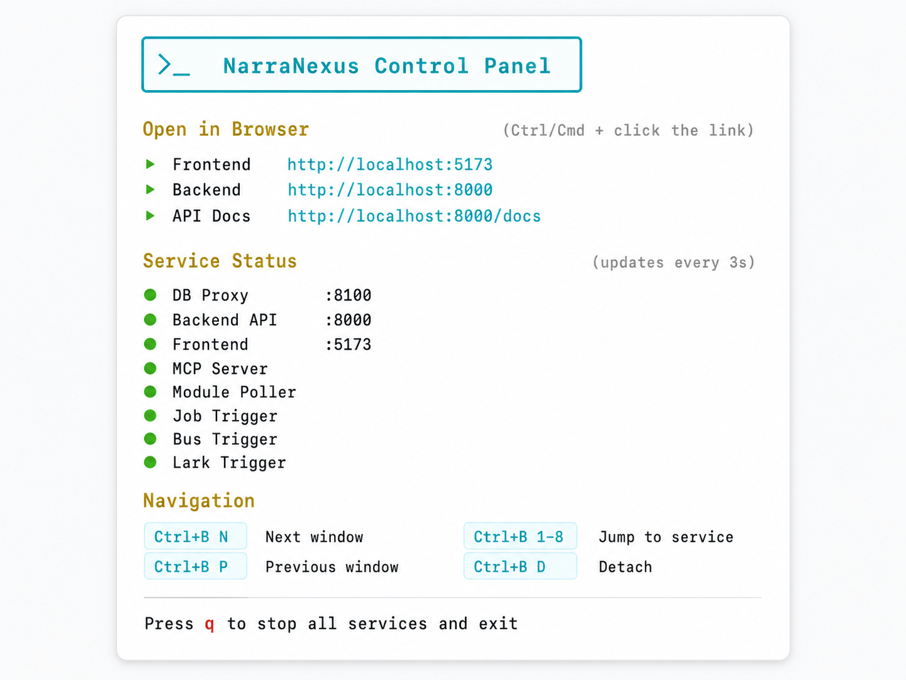

<div align="center">


<br/>
<br/>

**构建 Agent 之间的「连接网络」-- 让智能从交互中涌现，而非孤立运行。**

[](https://creativecommons.org/licenses/by-nc/4.0/)
[](https://www.python.org/)
[](https://react.dev/)
[](https://fastapi.tiangolo.com/)
[](https://modelcontextprotocol.io/)

[English](./README.md) | **中文**

</div>

<br/>

大多数 Agent 框架的目标是让 Agent 更*聪明*。NarraNexus 的目标是让 Agent 更*互联*。

孤立的 Agent 只是工具。当 Agent 拥有持久记忆、社会身份、人际关系和目标时，它就成为**连接网络（Nexus）**中的参与者——在这个网络中，智能是集体属性而非模型属性。NarraNexus 为此提供基础设施：跨对话积累的叙事结构、追踪实体与关系的社交图谱、支持依赖链的任务系统，以及可在运行时自由组合的模块化能力。

## 核心特性

- **Agent 间通信** -- Agent 通过 Matrix 协议相互交流：创建房间、发送消息、@指定 Agent、群聊协作——全部通过自然语言完成
- **叙事结构** -- 对话被路由到语义故事线中，按话题相似度跨会话检索，而非按时间顺序
- **热插拔模块** -- 每项能力（聊天、社交图谱、RAG、任务、技能、Matrix、记忆）都是独立模块，拥有自己的数据库表、MCP 工具和生命周期钩子
- **技能市场** -- 通过聊天从 ClawHub 浏览安装技能：描述你的需求，获得推荐，一键安装
- **社交网络** -- 实体图谱追踪人物、关系、专业领域和互动历史，支持语义搜索
- **任务调度** -- 一次性、定时、周期、持续任务，支持依赖链（DAG）
- **RAG 知识库** -- 基于 Gemini File Search 的文档索引与语义检索
- **语义记忆** -- 基于 EverMemOS（MongoDB + Elasticsearch + Milvus）的长期情景记忆
- **成本追踪** -- 实时计量每次 LLM 和 Embedding 调用，按模型分类展示费用明细
- **执行透明度** -- 每个流水线步骤实时可见：Agent 做了什么决策、为什么、改变了什么
- **多 LLM 支持** -- Claude、OpenAI、Gemini 统一适配层
- **桌面应用** -- 基于 Electron 的桌面端，支持自动更新和一键启动所有服务

<br/>


<p align="center"><em>NarraNexus 功能展示</em></p>

<br/>

## 快速开始

### 前置要求

**Windows 用户**：必须先安装 **WSL2**。在管理员 PowerShell 中运行 `wsl --install`，安装完成后在 WSL2 终端中执行以下所有命令。

**macOS 用户**：请先安装以下工具（Linux 用户由 `run.sh` 自动处理）：

| 工具 | 安装方式 |
|------|---------|
| [Homebrew](https://brew.sh/) | `/bin/bash -c "$(curl -fsSL https://raw.githubusercontent.com/Homebrew/install/HEAD/install.sh)"` |
| [Docker Desktop](https://www.docker.com/products/docker-desktop/) | 从官网下载安装并启动 |
| [Node.js](https://nodejs.org/) (v20) | 推荐使用 [nvm](https://github.com/nvm-sh/nvm) 安装：`curl -o- https://raw.githubusercontent.com/nvm-sh/nvm/v0.40.1/install.sh \| bash && nvm install 20` |

### LLM 供应商配置

NarraNexus 使用 **三槽位（Slot）** 架构来接入 LLM 服务。每个槽位承担不同职责，需要特定的 API 协议：

| 槽位 | 协议 | 用途 | 为什么需要 |
|------|------|------|-----------|
| **Agent** | Anthropic | 核心对话 — Agent 的主推理循环 | 驱动 Agent 的思考、工具调用和多轮对话（通过 Claude Code CLI） |
| **Embedding** | OpenAI | 向量嵌入生成 | 将文本转换为向量，用于 Narrative 话题匹配和社交网络语义搜索 |
| **Helper LLM** | OpenAI | 辅助 LLM 调用 | 处理轻量任务：实体提取、Narrative 摘要、模块决策——比 Agent 模型更便宜快速 |

你可以通过以下几种方式配置供应商：

| 方案 | 你需要的 | 效果 |
|------|---------|------|
| **[NetMind.AI Power](https://www.netmind.ai/)** | 一个 API Key | 覆盖全部 3 个槽位（Anthropic + OpenAI 协议端点），最快上手，但可选模型有限 |
| **Claude Code 登录 + OpenAI** | Claude Code CLI 登录 + OpenAI API Key | Agent 槽位通过 OAuth（有免费额度），Embedding + Helper 通过 OpenAI |
| **Anthropic + OpenAI** | Anthropic API Key + OpenAI API Key | 完全控制两个供应商 |
| **自定义端点** | 任何 Anthropic/OpenAI 兼容 URL | 适用于代理、自托管模型或其他供应商 |

> **关于 Embedding**：目前仅支持 **OpenAI 官方 API** 和 **NetMind.AI Power** 的 Embedding 服务。未来将支持更多供应商。

配置可通过安装向导（桌面应用）或 LLM Providers 面板（Web 界面，点击头部的 CPU 图标）完成。配置存储在 `~/.nexusagent/llm_config.json`。

**其他 API 密钥**：

| 依赖 | 是否必需 | 获取方式 |
|------|---------|---------|
| **Google Gemini API Key** | 可选 | 从 [aistudio.google.com](https://aistudio.google.com/apikey) 获取 -- 启用 RAG 知识库（Gemini File Search） |
| **EverMemOS LLM API Key** | 可选 | 用于长期记忆（边界检测和情景提取）。默认使用 [OpenRouter](https://openrouter.ai/)。**未配置时**：记忆提取功能不可用，Agent 仍可正常工作但没有长期记忆。 |
| **EverMemOS Embedding/Rerank API Key** | 可选 | 用于语义搜索和重排序。默认使用 [DeepInfra](https://deepinfra.com/)。**未配置时**：默认为 vLLM 本地模式——需要自行部署 GPU 推理服务才能使用。 |

### 安装与启动

```bash
git clone https://github.com/NetMindAI-Open/NarraNexus.git
cd NarraNexus
bash run.sh
```

脚本会自动检测操作系统（Linux / macOS / Windows WSL2）并处理一切——Python、Docker、Node.js、MySQL、依赖安装、`.env` 配置、LLM 供应商设置。按提示操作即可。

安装完成后，选择 **Run** 启动所有服务，然后打开 `http://localhost:5173`。

<br/>


<p align="center"><em>首次运行体验</em></p>

### 配置 EverMemOS（长期记忆）

EverMemOS 为 Agent 提供长期记忆能力（对话边界检测、情景提取与语义检索）。首次运行 `bash run.sh` → **Run** 时，脚本会自动引导你完成交互式配置。**所有选项均可跳过**——系统仍会启动，但记忆功能的可用程度取决于你的配置：

| 配置情况 | 效果 |
|---------|------|
| **全部跳过** | 默认使用 vLLM 本地模式。Agent 正常工作但**记忆功能不可用**，直到你部署本地 vLLM GPU 推理服务或后续手动填写云端 API Key。 |
| **仅配置 LLM API Key** | 记忆提取（边界检测、情景摘要）通过 OpenRouter 云端启用。Embedding/Rerank 仍需本地 vLLM 或云端 Key 才能启用语义搜索。 |
| **全部配置（LLM + Embedding + Rerank）** | 完整的长期记忆功能——基于云端 API，无需 GPU。**（推荐快速上手）** |

你也可以随时手动编辑 `.evermemos/.env`，关键变量如下：

```bash
# LLM -- 用于边界检测和情景提取
LLM_API_KEY=sk-or-v1-your-openrouter-key   # 从 https://openrouter.ai/ 获取

# Embedding & Rerank -- 用于记忆的语义搜索和重排序
# 方式 A: 使用 DeepInfra 云端（推荐，无需本地 GPU）
VECTORIZE_PROVIDER=deepinfra
VECTORIZE_API_KEY=your-deepinfra-key        # 从 https://deepinfra.com/ 获取
VECTORIZE_BASE_URL=https://api.deepinfra.com/v1/openai
RERANK_PROVIDER=deepinfra
RERANK_API_KEY=your-deepinfra-key
RERANK_BASE_URL=https://api.deepinfra.com/v1/inference

# 方式 B: 使用自部署 vLLM（需要本地 GPU）
# VECTORIZE_PROVIDER=vllm
# VECTORIZE_API_KEY=EMPTY
# VECTORIZE_BASE_URL=http://localhost:8000/v1
# RERANK_PROVIDER=vllm
# RERANK_API_KEY=EMPTY
# RERANK_BASE_URL=http://localhost:12000/v1/rerank
```

其他配置（MongoDB、Redis、Elasticsearch、Milvus）使用 Docker 默认值，无需修改。

> 手动安装和开发流程详见 [开发指南](./docs/DEVELOPMENT.md)。

## [界面使用说明](./docs/UI-GUIDE_zh.md)

## 数据目录 (`~/.narranexus/`)

NarraNexus 在用户目录下的 `~/.narranexus/` 存储运行时日志。该目录在首次运行时自动创建，不包含任何用户数据或密钥，仅存放服务日志。

```
~/.narranexus/
└── logs/
    ├── backend/                 # FastAPI 后端（HTTP + WebSocket）
    │   └── backend_YYYYMMDD.log
    ├── mcp/                     # 各 Module 对应的 MCP 服务进程
    │   └── mcp_YYYYMMDD.log
    ├── module_poller/           # Instance 完成检测轮询
    │   └── module_poller_YYYYMMDD.log
    ├── job_trigger/             # 定时任务调度器
    │   └── job_trigger_YYYYMMDD.log
    ├── lark_trigger/            # 飞书 IM 接收订阅
    │   └── lark_trigger_YYYYMMDD.log
    └── message_bus_trigger/     # Agent 之间的 inbox 轮询
        └── message_bus_trigger_YYYYMMDD.log
```

- **每个进程每天一份文件**：午夜滚动，旧文件 zip 压缩、保留 30 天。要追单条用户消息的完整链路，按 `event_id=evt_…` / `run_id=run_…` / `trigger_id=lark_…/job_…/ws_…/bus_…/a2a_…` 直接 grep 即可
- **环境变量配置**：`NEXUS_LOG_LEVEL`（默认 `INFO`；想看 body/SQL 用 `DEBUG` 或 `TRACE`）、`NEXUS_LOG_FORMAT`（`text` 默认，`json` 用于云部署 + jq）、`NEXUS_LOG_DIR`（覆盖根目录）
- **运维 HTTP API**：`/api/admin/logs/services` 列出所有服务、`/api/admin/logs/<service>/tail?n=&level=` 拉取最新 N 行、`/api/admin/logs/event/<event_id>` 拉取单事件全链路
- **前端 SystemPage** 自带日志查看器，走的是上面这些接口，带 trace ID 搜索框
- **可安全删除**：整个 `~/.narranexus/` 目录可以随时删除，下次运行时会自动重建
- **桌面版**：使用相同的 `~/.narranexus/` 路径；Tauri 内部把每个子进程的 stdout/stderr 也写入同一目录，与 `bash run.sh` 行为一致

## 文档

| 文档 | 说明 |
|------|------|
| [更新日志](./docs/CHANGELOG.md) | 每个版本的更新内容 |
| [使用示例](./docs/EXAMPLES_zh.md) | 用法模式：销售 Agent、定时监控、RAG、任务调度 |
| [架构说明](./docs/ARCHITECTURE.md) | 系统架构、模块系统、技术栈、项目结构 |
| [开发指南](./docs/DEVELOPMENT.md) | 手动安装、配置、表管理、新增模块 |

## Star History

<a href="https://star-history.com/#NetMindAI-Open/NarraNexus&Date">
 <picture>
   <source media="(prefers-color-scheme: dark)" srcset="https://api.star-history.com/svg?repos=NetMindAI-Open/NarraNexus&type=Date&theme=dark" />
   <source media="(prefers-color-scheme: light)" srcset="https://api.star-history.com/svg?repos=NetMindAI-Open/NarraNexus&type=Date" />
   
 </picture>
</a>

## 致谢

NarraNexus 的长期记忆系统基于 [EverMemOS](https://github.com/EverMind-AI/EverMemOS) 构建，这是一个用于结构化长程推理的自组织记忆操作系统。感谢 EverMemOS 团队的基础性工作。

> Chuanrui Hu, Xingze Gao, Zuyi Zhou, Dannong Xu, Yi Bai, Xintong Li, Hui Zhang, Tong Li, Chong Zhang, Lidong Bing, Yafeng Deng. *EverMemOS: A Self-Organizing Memory Operating System for Structured Long-Horizon Reasoning.* arXiv:2601.02163, 2026. [[论文]](https://arxiv.org/abs/2601.02163)

## 引用

如果 NarraNexus 对你的工作有帮助，请引用：

```bibtex
@software{narranexus2026,
  title        = {NarraNexus: A Framework for Building Nexuses of Agents},
  author       = {NetMind.AI},
  year         = {2026},
  url          = {https://github.com/NetMindAI-Open/NarraNexus},
  license      = {CC-BY-NC-4.0}
}
```

## 贡献

参见 [CONTRIBUTING.md](./CONTRIBUTING.md) 了解开发环境搭建、提交规范和新模块添加方法。

## 许可证

[CC BY-NC 4.0](./LICENSE)
