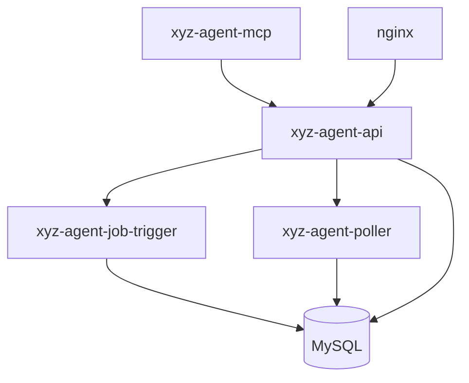

# Service Architecture

This document describes the responsibilities and interactions of each backend service.

## Service List

### 1. xyz-agent-mcp (MCP Server)

**Ports**: 7801-7805 (internal)
**Start command**: `python src/xyz_agent_context/module/module_runner.py mcp`

**Responsibilities**:
- Starts multiple MCP servers, one port per Module
- Provides Tools for LLM to invoke
- Handles Agent tool call requests

**MCP Port Mapping**:
| Module | Port | Tools |
|--------|------|-------|
| AwarenessModule | 7801 | awareness_get, awareness_update |
| SocialNetworkModule | 7802 | extract_entity, recall_entity, search_social_network |
| JobModule | 7803 | job_create, job_retrieval_* |
| ChatModule | 7804 | send_message_to_user_directly, get_inbox_status, agent_send_* |
| GeminiRAGModule | 7805 | rag_query, rag_upload_file, rag_upload_text |

### 2. xyz-agent-api (FastAPI Backend)

**Port**: 8000 (internal, proxied through Nginx)
**Start command**: `uvicorn backend.main:app --port 8000`

**Responsibilities**:
- Provides REST API and WebSocket interfaces
- Handles user requests (chat, file upload, task management, etc.)
- Orchestrates AgentRuntime execution

**Main Endpoints**:
- `/api/auth/*` - User authentication
- `/api/agents/*` - Agent management
- `/api/jobs/*` - Job management
- `/api/inbox/*` - Inbox
- `/ws/agent/run` - WebSocket streaming responses

### 3. xyz-agent-job-trigger (Job Execution Trigger)

**Port**: None (background polling)
**Start command**: `python -m xyz_agent_context.module.job_module.job_trigger --interval 60`

**Responsibilities**:
1. **Poll database**: Every 60 seconds, find Jobs due for execution (`next_run_time <= now` and `status = PENDING/ACTIVE`)
2. **Execute Jobs**: Invoke AgentRuntime to run the task
3. **Write results**: Write execution results to the user's Inbox
4. **Update status**: Update Job status (RUNNING → COMPLETED/FAILED) and next execution time

**Execution Flow**:
```
Job due → JobTrigger detects → Update to RUNNING → Invoke AgentRuntime
       → Execution complete → Write to Inbox → Update to COMPLETED
```

**Configuration**:
- `--interval 60` - Polling interval (seconds)

### 4. xyz-agent-poller (Instance Status Poller)

**Port**: None (background polling)
**Start command**: `python -m xyz_agent_context.services.module_poller`

**Responsibilities**:
1. **Detect completion**: Poll the `module_instances` table for Instances with `status = COMPLETED`
2. **Trigger dependency chains**: Check if other Instances depend on the completed one
3. **Unblock dependents**: Change dependent Instances from `BLOCKED` to `ACTIVE`
4. **Background execution**: Trigger execution of the dependent Instances

**Execution Flow**:
```
Instance A completes → ModulePoller detects → Find Instances depending on A (Instance B)
                    → B's dependencies satisfied → B: BLOCKED → ACTIVE
                    → Trigger B's execution in background
```

**Configuration**:
- `--interval 5` - Polling interval (seconds, default 5)
- `--workers 3` - Worker threads (default 3)

### 5. nginx (Web Server)

**Port**: 80 (public)
**Config file**: `/etc/nginx/sites-available/xyz-agent.conf`

**Responsibilities**:
- Serve frontend static files
- Reverse proxy backend API
- Proxy WebSocket connections

**Routing Rules**:
```
/ → frontend/dist/
/api/ → http://localhost:8000/api/
/ws/ → http://localhost:8000/ws/ (WebSocket)
```

## Service Interaction Flows

### Scenario 1: User Sends a Chat Message

```
User → Nginx (80) → FastAPI (8000) → AgentRuntime
                                    ↓
                                  MCP Servers (7801-7805)
                                    ↓
                                  Return response → User
```

### Scenario 2: Creating a Scheduled Job

```
User creates Job → FastAPI → Write to DB (status = PENDING)
                              ↓
                        JobTrigger polls → Detects due Job
                              ↓
                        Execute Job → Update status → Write to Inbox
                              ↓
                        ModulePoller detects completion → Trigger dependent Jobs
```

### Scenario 3: Complex Job Dependency Chain

```
LLM creates dependent Jobs A, B, C:
  - A: status = ACTIVE (no dependencies)
  - B: status = BLOCKED (depends on A)
  - C: status = BLOCKED (depends on B)

JobTrigger: Execute A → A completes (status = COMPLETED)
            ↓
ModulePoller: Detect A complete → Unblock B (B: BLOCKED → ACTIVE)
            ↓
JobTrigger: Execute B → B completes
            ↓
ModulePoller: Detect B complete → Unblock C (C: BLOCKED → ACTIVE)
            ↓
JobTrigger: Execute C → C completes
```

## Service Dependency Graph



**Startup Order**:
1. xyz-agent-mcp (MCP server starts first)
2. xyz-agent-api (depends on MCP)
3. xyz-agent-poller (depends on API)
4. xyz-agent-job-trigger (depends on API)
5. nginx (can start independently)

## Monitoring and Maintenance

### View Service Status

```bash
# View all services
sudo systemctl status xyz-agent-mcp xyz-agent-api xyz-agent-poller xyz-agent-job-trigger nginx

# View a single service
sudo systemctl status xyz-agent-job-trigger
```

### View Logs

```bash
# JobTrigger logs (Job execution records)
sudo journalctl -u xyz-agent-job-trigger -f

# ModulePoller logs (dependency trigger records)
sudo journalctl -u xyz-agent-poller -f

# API logs
sudo journalctl -u xyz-agent-api -f

# Nginx access logs
sudo tail -f /var/log/nginx/xyz-agent-access.log

# Nginx error logs
sudo tail -f /var/log/nginx/xyz-agent-error.log
```

### Restart Services

```bash
# Restart all backend services
sudo systemctl restart xyz-agent-mcp xyz-agent-api xyz-agent-poller xyz-agent-job-trigger

# Restart a single service
sudo systemctl restart xyz-agent-job-trigger
```

## Performance Tuning

### JobTrigger Tuning

Adjust the polling interval to balance response speed and system load:

```bash
# Edit service config
sudo nano /etc/systemd/system/xyz-agent-job-trigger.service

# Modify the --interval parameter in the ExecStart line
ExecStart=.../python -m xyz_agent_context.module.job_module.job_trigger --interval 30

# Reload and restart
sudo systemctl daemon-reload
sudo systemctl restart xyz-agent-job-trigger
```

**Recommended values**:
- Development: `--interval 10` (fast response)
- Production: `--interval 60` (reduce database load)

### ModulePoller Tuning

```bash
# Adjust polling interval and worker threads
ExecStart=.../python -m xyz_agent_context.services.module_poller --interval 5 --workers 5
```

**Recommended values**:
- High concurrency: `--interval 3 --workers 5`
- Low load: `--interval 10 --workers 2`

## Troubleshooting

### JobTrigger Not Executing Jobs

**Checklist**:
1. Is the service running: `sudo systemctl status xyz-agent-job-trigger`
2. Check log errors: `sudo journalctl -u xyz-agent-job-trigger -n 100`
3. Check database connection: Look for database errors in the logs
4. Check Job status: Verify the Job's `next_run_time` and `status`

### ModulePoller Not Triggering Dependencies

**Checklist**:
1. Is the service running: `sudo systemctl status xyz-agent-poller`
2. Check logs: `sudo journalctl -u xyz-agent-poller -f`
3. Check Instance status: Verify that the dependent Instance has completed
4. Check dependency config: Verify the `dependencies` field is correct

### Services Restarting Frequently

**Possible causes**:
1. Database connection failure: Check `.env` configuration
2. Port conflicts: Check if ports 8000, 7801-7805 are occupied
3. Insufficient memory: Use `htop` to check memory usage
4. Python environment issues: Verify virtual environment path is correct

## Security Recommendations

1. **Do not expose internal ports**: Ports 8000, 7801-7805 should not be publicly accessible
2. **Log rotation**: Ensure log files don't grow indefinitely
3. **Monitoring alerts**: Set up service status monitoring with alerts for anomalies
4. **Resource limits**: Consider setting memory and CPU limits for services

```bash
# Add resource limits in systemd service files
[Service]
MemoryLimit=2G
CPUQuota=50%
```
