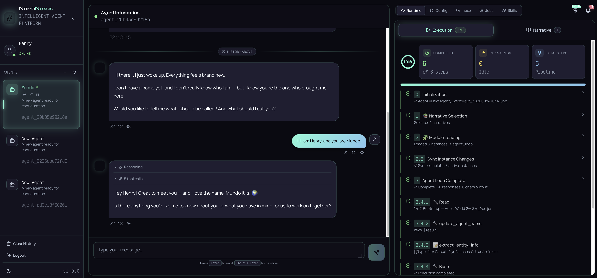

[← Back to README](../README.md)

# UI Guide

## Login & Create Agent

1. Open `http://localhost:5173` and enter any **User ID** to log in (e.g., `user_alice`) -- the system identifies users by User ID
2. First-time use requires creating an Agent: click the create button in the sidebar and enter the **Admin Secret Key** (the `ADMIN_SECRET_KEY` value from your `.env` file, default: `nexus-admin-secret`)
3. Once created, your Agent appears in the sidebar -- click to start chatting

## Interface Layout

<br/>


<p align="center"><em>NarraNexus Interface</em></p>

<br/>

The main interface uses a three-column layout:

```
┌──────────┬─────────────────────┬──────────────────────┐
│ Sidebar  │    Chat Panel       │   Context Panel      │
│          │                     │                      │
│ Agent    │  Message stream     │  Tabs:               │
│ List     │  (real-time)        │  · Runtime           │
│          │  History            │  · Agent Config      │
│          │  Input              │  · Agent Inbox       │
│          │                     │  · Jobs              │
│          │                     │  · Skills            │
│          │                     │  💰 Cost (top bar)   │
└──────────┴─────────────────────┴──────────────────────┘
```

## Sidebar

- Shows your agent list after login; click to switch agents
- Switching agents auto-loads all data for that agent

## Chat Panel

- Primary interaction with the agent, streamed in real-time via WebSocket
- Execution steps appear in the right-side "Runtime" tab during streaming
- History (last 20 messages) loads automatically on agent switch

## Context Panel

The right panel has multiple tabs showing agent state:

| Tab | Function | Manual refresh needed? |
|-----|----------|:---:|
| **Runtime** | Current pipeline steps + Narrative list | Narratives need 🔄 |
| **Agent Config** | Agent self-awareness (editable) + Social network (searchable) + RAG files | Needs 🔄 |
| **Agent Inbox** | Messages the agent received from other users | Needs 🔄 |
| **Jobs** | List / dependency graph / timeline views, filter by status, cancel jobs | Needs 🔄 |
| **Skills** | Available tools and skills | Needs 🔄 |

> **⚠️ Important: Data in the right panel does not auto-update (except chat messages).** After you ask the agent to modify Awareness, create jobs, or update the social network via chat, click the 🔄 refresh button in the corresponding tab header to see the latest data.

## Typical Workflow

1. **Login** → Select or create an agent
2. **Chat to configure** → Use natural language to set up Awareness (role, goals, key info)
3. **Refresh Agent Config tab** → Click 🔄 to confirm changes took effect
4. **Chat to assign tasks** → Use natural language to create jobs (cron, periodic, ongoing, etc.)
5. **Refresh Jobs tab** → Click 🔄 to see created jobs
6. **Ongoing interaction** → After agent executes tasks, refresh panels to see social network updates, narrative accumulation, etc.
